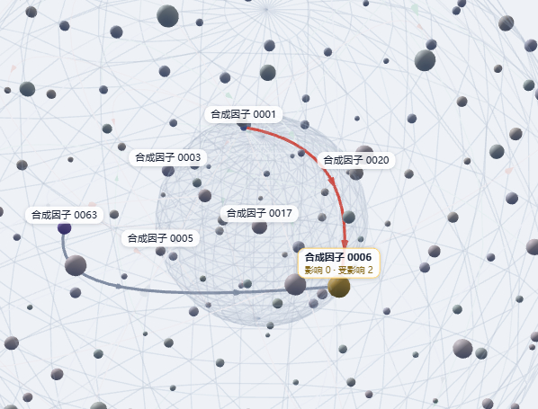
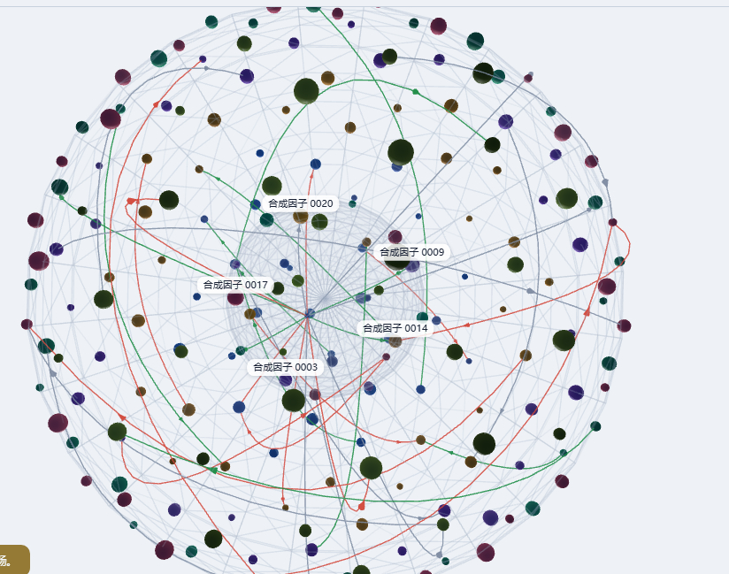
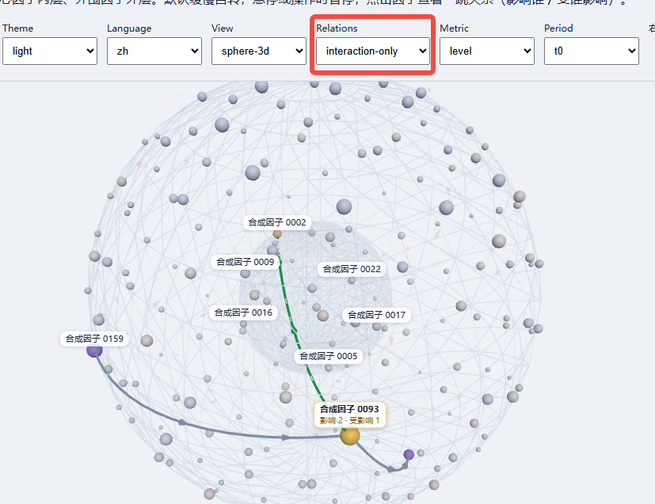
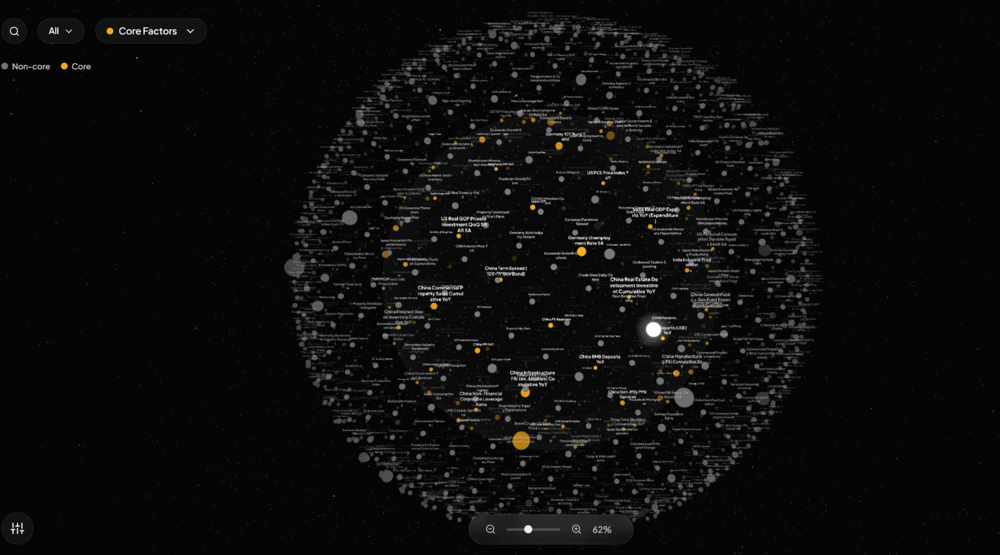
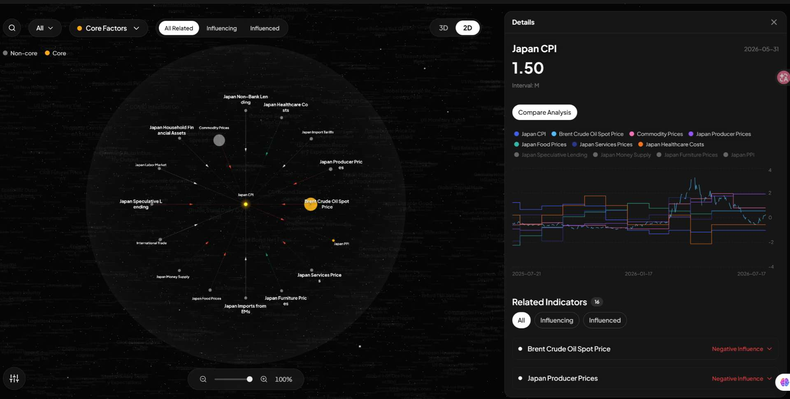
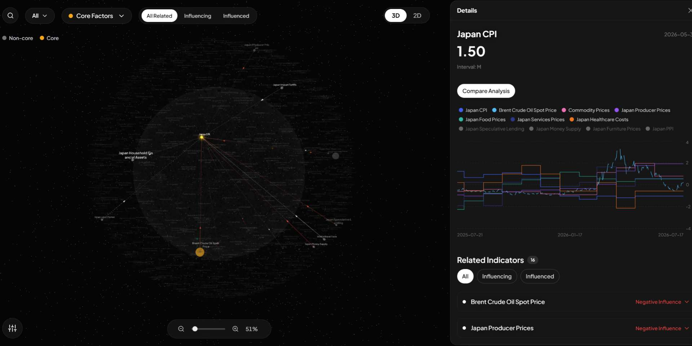

### 现状与问题

#### 标签显示问题

非相关因子出现标签的逻辑异常

当前效果：

### 旋转问题

选择没有按照y轴旋转，导致他会在用户拖动旋转时偏移

#### 环境光问题

疑似只加了单侧平行光，导致不同角度看到球体颜色产生偏差

当前效果：

#### 连线问题

同上图，出现了多组节点关系的连线，属于bug。

#### relations筛选失效

relations切换是无效的，当前切换不影响任何显示效果

#### 自动旋转/停止与预期不符

疑似设置了一个防抖暂停的机制，期望是用户悬浮节点时旋转停止，鼠标离开时恢复

#### 其余问题

---  ---

以下问题都有prompt的原因

- 内外层球表面显示纹理多余
- 节点/边/标签的色彩样式表现不准确
- 镜头缩放范围控制丢失
- 节点选中与右侧面板联动消失
- 透视效果消失，导致节点增加后视觉表现糟糕
- 2D场景平面表现错误，相关节点需要重布局
- 边的流光效果丢失
- 边的逻辑关系错误（数据关系建模错误）
- 选中时其他节点似乎没有淡化效果，只去除了颜色

### 预期效果

- 常态与节点悬浮高亮

- 选中节点展开2D视角，并联动展开右侧卡片

  

- 选中节点切换到3D视角

