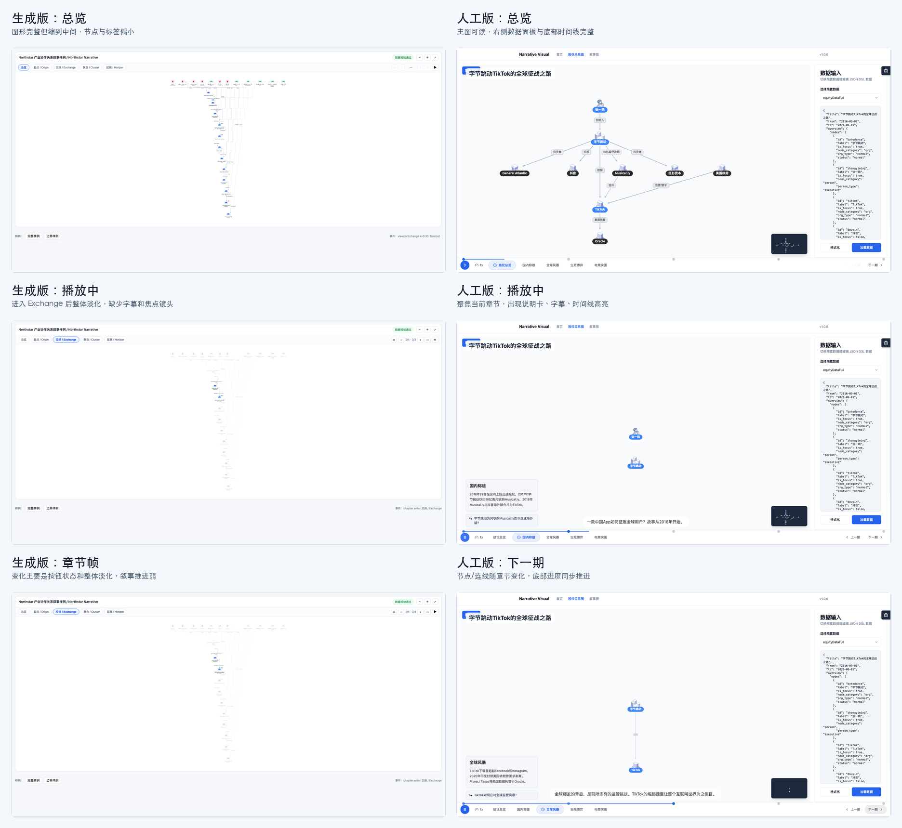
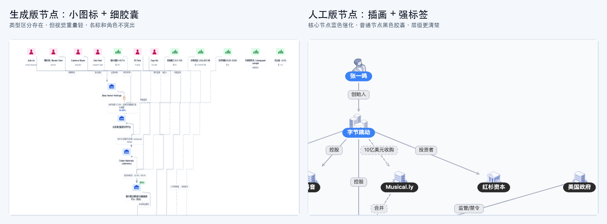
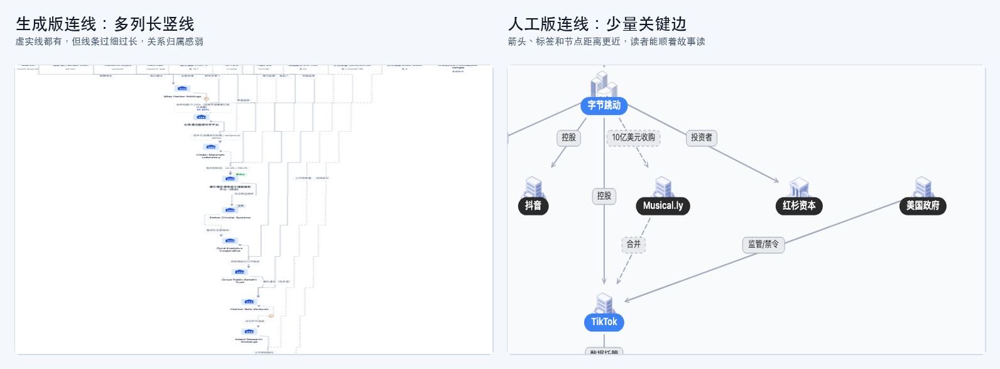
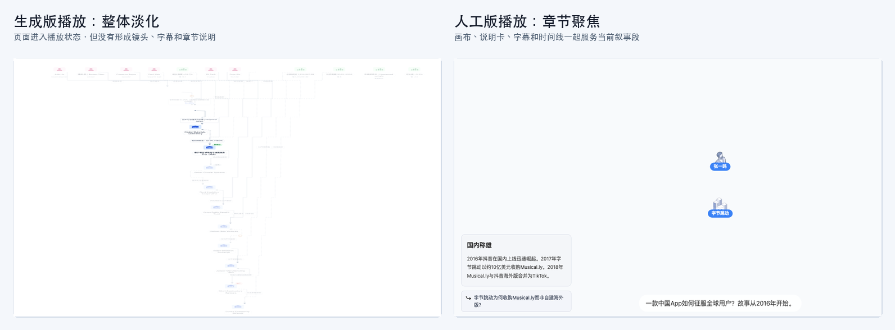

# 两版股权叙事可视化效果差异评测

## 1. 播放过程差异

### 生成版

生成版有章节按钮、前后切换按钮和播放按钮。点击播放后，右上角状态会从播放按钮变成暂停按钮，章节状态也会变化，例如进入 `Exchange`。但画面变化主要表现为“全图淡化”和按钮状态变化，主画面仍然停留在远距离纵向总览视角。

播放过程中的问题：

- 没有明显镜头聚焦，当前章节相关节点没有被放大到可读尺度。
- 没有字幕，用户不知道当前 step 正在讲哪一句结论。
- 没有章节说明卡，关系变化缺少文字解释。
- 没有底部时间线，用户难以判断当前处于第几章、第几步、进度到哪里。
- 播放状态改变后，图形仍然很小，节点和边标签继续难读。

### 人工版

人工版点击播放后，画面会进入明确的章节叙事状态。比如进入“国内称雄”时，画布只保留当前相关的“张一鸣 -> 字节跳动”主体，其他无关节点被收起或隐藏，同时出现左侧章节说明卡、底部字幕和时间线高亮。

播放过程中的优势：

- 当前章节会形成视觉焦点，不再让用户从整张总览里自己找重点。
- 底部时间线清楚标记当前章节和播放进度。
- 左侧说明卡补充背景，底部字幕给出当前叙事句。
- 下一期切换后，节点和连线会随章节内容重新组织，进度条也同步推进。
- 播放过程更像“讲故事”，而不是“切换图层状态”。

结论：生成版具备播放控件雏形，但播放体验弱；人工版具备真正的叙事播放器体验。

## 2. 节点效果差异

### 生成版

生成版节点类型比较丰富，包含人物、组织、指标等类型。人物节点使用粉色图标，组织节点使用蓝色建筑图标，指标节点使用绿色柱状图图标。节点标签采用细边框胶囊，整体风格轻量。

已实现效果：

- 节点类型有区分。
- 名称、角色、指标值能放进节点区域。
- 上方人物和指标节点能形成一排外部角色/信息入口。
- 组织节点沿纵向链条排列，能表达实体演变路径。

主要不足：

- 节点整体太小，图标、名称、角色说明都不够突出。
- 人物、组织、指标虽然有颜色差异，但视觉等级不明显。
- 关键节点没有强中心感，用户不容易一眼识别故事主角。
- 顶部节点数量多，但每个节点视觉重量相近，信息主次不清。
- 播放时节点没有被有效放大或聚焦，仍然像总览缩略图。

### 人工版

人工版节点数量更少，但每个节点的视觉识别更强。人物节点使用插画头像，公司/机构节点使用建筑插画，核心节点使用蓝色强标签，普通节点使用黑色胶囊标签。

优势：

- “张一鸣”“字节跳动”“TikTok”等核心节点非常突出。
- 插画 + 胶囊标签组合增强了实体识别度。
- 蓝色标签代表焦点主体，黑色标签代表外部实体，层级清楚。
- 节点大小更适合阅读，用户不用缩放也能识别名称。
- 播放时会按章节保留当前相关节点，降低认知负担。

结论：生成版节点信息更密，但像数据罗列；人工版节点更少，但更有叙事主次和视觉记忆点。

## 3. 连线效果差异

### 生成版

生成版实现了实线、虚线、箭头、边标签和百分比标签，说明基础关系表达是完整的。它能表达控制、协作、审查、趋势、映射等多种关系。

已实现效果：

- 实线和虚线都有。
- 边上有关系文字。
- 部分边带有百分比或状态标签。
- 长链条可以表达组织连续演变。

主要不足：

- 右侧多列长竖线过多，视觉上像网格或辅助线，关系归属感弱。
- 连线过细、过浅，尤其播放淡化后更难看清。
- 边标签离节点和箭头较远，用户需要花时间判断标签属于哪条边。
- 多条线平行下探，缺少“当前关键关系”的强调。
- 关系线覆盖范围很长，但没有形成分段叙事节奏。

### 人工版

人工版连线数量更克制，重点放在投资、控股、收购、合并、监管/禁令、数据托管等关键关系上。线条更粗，箭头方向更明确，边标签距离相关节点更近。

优势：

- 关系线服务故事主线，而不是展示所有可能关系。
- 箭头方向清晰，能顺着线读出关系流向。
- 边标签背景明显，文字可读性更好。
- 虚线用于表达并购、合并等特殊关系，语义更直观。
- 跨层连线虽然存在，但数量少，读者能判断其叙事意义。

结论：生成版“关系种类多”，人工版“关键关系清楚”。股权叙事可视化更需要后者。

## 4. 播放聚焦效果差异

### 生成版

生成版播放时把一部分元素淡化，但没有把当前讲述对象组织成新的阅读画面。用户看到的仍然是一个缩小版全局关系图，只是部分颜色变淡。

表现问题：

- 当前章节没有变成画面中心。
- 无关节点和长线仍然占据背景。
- 没有字幕提示当前叙事句。
- 没有说明卡解释章节背景。
- 播放过程缺少“出现、强调、推进、收束”的节奏。

### 人工版

人工版播放时会把当前章节的节点和关系单独聚焦出来。例如“国内称雄”阶段只保留张一鸣和字节跳动，并配合说明卡和字幕解释“为什么收购 Musical.ly 而非自建海外版”。下一阶段再切到新的关键关系。

优势：

- 当前故事段有清楚的镜头语言。
- 节点数量减少，用户注意力集中。
- 字幕和说明卡补足关系图无法表达的上下文。
- 底部时间线告诉用户这是一个连续叙事，而不是静态图筛选。
- 章节切换后，节点/连线/文字说明同步变化。

结论：生成版播放是“状态变化”，人工版播放是“叙事聚焦”。

## 5. 画布和辅助信息差异

### 生成版

生成版画布非常干净，顶部是标题和章节按钮，右上角是缩放、播放和前后切换控件，底部有样例按钮和事件提示。

优点：

- 界面轻量。
- 控件数量少。
- 图形区域无遮挡。
- 有数据校验状态和事件提示。

不足：

- 主图有效占屏过小，大片空白没有转化成可读性。
- 没有叙事标题区、章节说明区、字幕区、时间线区。
- 缩略图、当前章节进度、上一期/下一期等导航缺失。
- 事件提示偏调试信息，对业务观看帮助有限。

### 人工版

人工版画布由主图、右侧数据输入面板、底部时间线、缩略图、播放控制、章节说明和字幕共同组成。它不是单纯展示一张图，而是把图放进叙事播放器框架里。

优点：

- 主图、数据、控制、字幕分区清楚。
- 右侧数据面板让用户知道当前图由什么 DSL 驱动。
- 底部时间线让章节切换和播放状态可感知。
- 缩略图提供全局位置感。
- 播放按钮、速度、上一期/下一期形成完整观看路径。

不足：

- 界面元素比生成版多，视觉上更重。
- 右侧数据面板占用画布宽度，适合评测/调试场景，正式嵌入业务页时可能需要收起。

结论：生成版像“干净的图展示页”，人工版像“可观看、可调试的叙事产品”。

## 6. 差异总结

| 对比项 | 提示词生成版 | 人工开发基准版 |
| --- | --- | --- |
| 总览画面 | 完整可见，但整体过小 | 居中可读，主次清楚 |
| 播放过程 | 控件状态变化，全图淡化 | 章节聚焦、字幕、说明卡、时间线同步 |
| 节点效果 | 类型丰富但视觉重量轻 | 插画节点 + 强标签，核心主体突出 |
| 连线效果 | 多列长线，关系归属弱 | 少量关键边，方向和标签更清楚 |
| 叙事节奏 | 像静态图切章节 | 像按章节讲故事 |
| 信息层级 | 节点和指标较平均 | 主体、外部实体、关系标签层级明确 |
| 辅助信息 | 事件提示和样例按钮 | 数据面板、章节、字幕、缩略图、播放进度 |

最终评价：生成版已经实现了股权叙事可视化的“元素集合”，包括节点类型、边类型、标签和章节按钮；但人工版实现的是“叙事观看体验”，通过节点聚焦、关键连线、字幕、章节说明和时间线，让用户能按故事顺序理解股权关系变化。这是两者最主要的效果差异。
