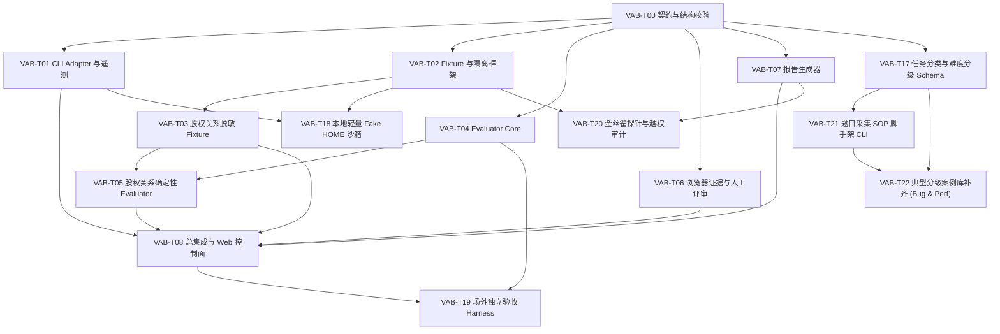

# 多 Agent 开发总控入口

本目录把 `vis-agent-bench` 的后续开发拆成可独立派发、可并行、可验收的原子任务。
设计参考 Narrative Code 的实践：任务编号、Wave、allowed paths、冻结验收、独立 evidence
和最终集成门。

## 开始前的硬前提

当前仓库必须先形成一次可复现的 Git baseline commit。没有 baseline 时，不创建并行
worktree，也不派发实现任务，否则无法区分各 Agent 的改动和用户已有内容。

总控只在以下条件满足后将任务从 `planned` 改为 `ready`：

1. 依赖任务已验收并合入集成分支；
2. 当前任务有独立 worktree 和 branch；
3. allowed paths 与同时运行的任务不重叠；
4. Prompt 中的验收命令在当前 baseline 上存在；
5. Agent 不会接触本任务禁止读取的答案或秘密。

## 任务图

## 推荐派发顺序

| Wave | 可派发任务 | 说明与并行性 |
|---|---|---|
| 0 | `VAB-T00` | 单独执行，冻结基础契约 |
| 1 | `VAB-T01`、`VAB-T02`、`VAB-T04`、`VAB-T06`、`VAB-T07` | 五个 worktree 并行 |
| 2 | `VAB-T03` | 等待 Fixture Framework |
| 3 | `VAB-T05`、`VAB-T09`、`VAB-T10`、`VAB-T11` | 3D / Heatmap Fixtures 与 Playwright Driver |
| 5 | `VAB-T12`、`VAB-T13`、`VAB-T15`、`VAB-T16` | 3D / Heatmap Evaluators 与加固 |
| 6 | `VAB-T08` | 总集成与 Web 控制面 |
| 7 | `VAB-T14` | 真实模型端到端 Pilot |
| 8 | `VAB-T17`、`VAB-T18`、`VAB-T19`、`VAB-T20`、`VAB-T21`、`VAB-T22` | **任务分类分级、本地轻量沙箱、场外验收、防作弊探针与采集工具** |

## 文件入口

- [总控协议](CONTROL_PROTOCOL.md)
- [机器可读任务目录](task-catalog.yaml)
- [总控 Prompt](MASTER_CONTROLLER_PROMPT.md)
- `prompts/`：可直接交给外部 Agent 的任务 Prompt
- `evidence/`：每个 Agent 的任务完成证据

## 第一轮建议

不要一次启动全部任务。先执行 `VAB-T00`，确认任务契约、Schema 与验证入口稳定；
验收通过后，再并行启动 Wave 1。

