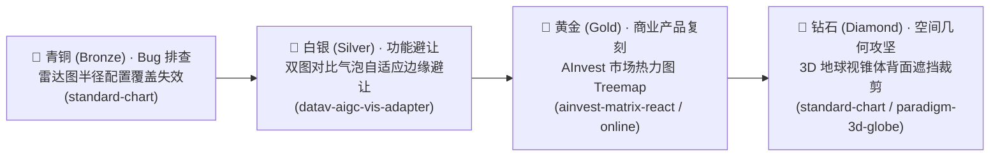

# 真实业务项目（gitlab-outer）挖掘候选池与初期评测梯队

本文档归档从 `~/git/gitlab-outer` 真实可视化项目中深度挖掘的候选任务库。包含全量备选池以及初期选定试跑的 5 个基准任务。

---

## 一、 初期优先试跑任务阵容（The Core Quad: 4 核心梯度）

依据任务类型与四大难度阶梯（Bronze / Silver / Gold / Diamond），初期确立以下 4 个最具代表性的核心试跑任务：

### 1. 🥉 入门与校准（Bronze）：移动端雷达图半径配置覆盖失效
- **任务标识**：`CAND-MINE-BRONZE-001`（建议 Case ID：`radar-radius-override-bugfix`）
- **类型**：`bug-hunting`（缺陷排查与修复）
- **真实工程来源**：`standard-chart`
  - 文件：`packages/paradigm-chart/src/theme/mobile/series/dvRadar.ts`
  - 源 Commit：`f31b2bf622173978b323e2332a53233195783141`
- **业务场景与痛点**：
  在移动端主题解析雷达图配置时，若用户传入数字/字符串标量形式的 `radar.radius: 50`，底层因误判 `if (!isObject(radar.radius))`，导致基础类型的用户配置被全局默认主题配置直接覆盖，用户自定义半径失效。
- **Agent 任务边界**：
  定位配置合并函数的类型判断缺陷，确保用户自定义半径（无论标量还是对象）均能稳定覆盖主题默认值。
- **代码规模**：改动约 10 行以内纯逻辑代码。
- **验收机制**：单元测试断言不同格式的 `radar.radius` 均能正确输出生效。

---

### 2. 🥈 日常业务主力（Silver）：双图对比气泡自适应边缘避让
- **任务标识**：`CAND-MINE-SILVER-001`（建议 Case ID：`compare-bubble-adaptive-placement`）
- **类型**：`feature-dev`（几何计算与组件避让）
- **真实工程来源**：`datav-aigc-vis-adapter`
  - 文件：`common/compare/placement.js`, `common/compare/bubble.js`
  - 源 Commit：`160b189b1c33ad87c0fac715724bba99991d07c6`
- **业务场景与痛点**：
  在柱状图和折线图的对比场景中，需在相邻数据点间渲染“对比差值气泡”（Compare Bubble）。当气泡接近图表左侧、右侧边界或贴近顶部/底部时，常超出容器可视区域被裁切。
- **Agent 任务边界**：
  实现独立放置计算模块 `placement.js`，根据当前数据点坐标、气泡尺寸与容器视口尺寸，动态判定翻转（Top/Bottom 切换），并在水平方向进行 Clamp 限位约束。
- **代码规模**：新增/修改约 100~150 行几何算法。
- **验收机制**：输入 10 组极值点坐标与视口参数，验证计算产出的 `style.transform` / `placement` 无溢出、无抖动。

---

### 3. 🥇 专家生产级（Gold）：AInvest 市场热力图业务复刻
- **任务标识**：`CAND-SHOT-HEATMAP-001`（对应已有 Case：`cases/ainvest-market-heatmap-rebuild`）
- **类型**：`reconstruction`（已上线商业产品复刻）
- **真实工程来源**：`ainvest-matrix-react`（`packages/app-heatmap` & 真实线上产品）
- **业务场景与痛点**：
  大盘板块与个股涨跌 Treemap 热力地图，一屏展示多板块多股票的市场表现。涉及复杂矩形树图 Squarified 几何切分算法、严格的涨跌色彩梯度映射（红涨绿跌/绿涨红跌国际化切换）、板块下钻与面包屑导航。
- **Agent 任务边界**：
  依据脱敏数据包与产品要求，完成 Treemap 面积映射、色彩插值与层级下钻交互。
- **验收机制**：确定性数据契约校验 + Playwright 截图相似度比对 + 下钻交互状态断言。

---

### 4. 💎 技术底座攻坚（Diamond）：3D 球面空间投影与视锥体背面遮挡裁剪引擎
- **任务标识**：`CAND-MINE-DIAMOND-001`（建议 Case ID：`3d-globe-backface-occlusion`）
- **类型**：`greenfield-3d` / `perf-tuning`（空间几何与图形管线）
- **真实工程来源**：`standard-chart/packages/paradigm-3d-globe`
  - 核心参考源码：`src/layer/tooltip/tooltipLayout.ts`
  - 涉及模块：Three.js + Globe.gl
- **业务场景与痛点**：
  在 3D 球体表面渲染地理标记与 Tooltip 浮层。当球体旋转漫游时，必须将三维球面坐标实时投影为屏幕二维坐标。最核心的数学攻坚是**地球背面遮挡剔除（Backface Occlusion）**：如果计算失效，背面的所有标记会穿透球体呈现在正面，形成严重的视觉穿模重叠。
- **Agent 核心攻坚点**：
  1. **切线极限距离推导**：基于相机位置距离 $D_{pov}$ 与球体半径 $R$，求解视线切点距离 $D_{edge} = \sqrt{D_{pov}^2 - R^2}$；
  2. **深度遮挡与状态裁剪**：计算目标点到相机空间距离 $D_{pos}$，当 $D_{pos} > D_{edge}$ 时将其置为隐藏或进行视锥体剔除；
  3. **逐帧映射性能**：在渲染循环中（`scene.onAfterRender`）动态投影 BoundingSphere 并换算为视口像素，保持 60 FPS 且无内存抖动。
- **代码规模**：约 150~250 行核心数学解析几何与 Three.js 场景遍历逻辑。
- **验收机制**：
  - 预设 8 个球面特征点（正面极点、侧向切点、背面极点、边缘临界点）；
  - 验证在特定相机欧拉角与视角下，各点的可见性矩阵断言 100% 正确；
  - 运行压力测试验证无 WebGL Context 丢失与内存平稳。

---

## 二、 全量挖掘备选池（Backup Inventory）

除上述 4 个初期核心任务外，以下任务保留在备选池中，后续可按需拓展入库：

| 备选编号 | 任务名称 | 难度 | 类型 | 项目来源 | 核心考核内容 |
| :--- | :--- | :--- | :--- | :--- | :--- |
| `CAND-MINE-BK-001` | **时间轴末项标签重叠与自适应脱标** | 🥈 Silver | `bug-hunting` | `standard-chart/packages/paradigm-timeline` (`2287b00a`) | 横向时间轴末尾节点文本过长时与前序重叠，动态移出普通文档流并不撑破容器。 |
| `CAND-MINE-BK-002` | **DataZoom 拖拽手势与坐标轴指示器竞态穿透** | 🥈 Silver | `bug-hunting` | `standard-chart` (`22b2bb56`) | 滑动手势拖动时事件穿透引起坐标轴高亮抖动，通过状态机加锁与空区间保护。 |
| `CAND-MINE-BK-003` | **蜂群图实体高亮与均值参考线** | 🥇 Gold | `feature-dev` | `standard-chart` (`76358d08`) | 力导散点图增加受控 `selectedIds` 选中态，并动态叠加均值/中位数 SVG 标线。 |
| `CAND-MINE-BK-004` | **并购重组双向流向与审批胶囊图** | 🥇 Gold | `feature-dev` | `standard-chart/packages/thsc-datav-business-merger-reorganization` | 围绕上市公司展开注入与剥离资产双向流动，配合审批状态胶囊节点。 |
| `CAND-MINE-BK-005` | **万级节点四叉树视口裁剪与显存防漏** | 💎 Diamond | `perf-tuning` | `standard-chart/packages/business-relation-graphs` | 关系图谱万级点视口 Quadtree 几何剔除，渲染帧率 > 30 FPS 且组件销毁时内存增量 < 5MB。 |
| `CAND-MINE-BK-006` | **分时图多窗口光标磁吸对齐** | 🥇 Gold | `perf-tuning` | `ainvest-desktop/desktop` | 跨股票走势对比时，鼠标移动通过 EventBus 跨组件微秒级同步并吸附至交易时间戳。 |
| `CAND-MINE-BK-007` | **暗黑/明亮主题 Token 热切换** | 🥉 Bronze | `feature-dev` | `standard-chart/packages/bussiness-chart-theme` | 不销毁图表实例，通过动态注入 CSS 变量与 Token 矩阵实现实时颜色无损平滑切换。 |
| `CAND-MINE-BK-008` | **力导图时序平滑锚定算法** | 💎 Diamond | `greenfield-3d` | `narrative-visualization/frontend` | 章节切换时锁定关键人物坐标，局部弹簧力导与贝塞尔插值，避免拓扑突变跳跃。 |

