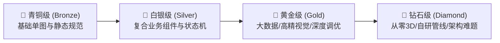

# 任务分类体系、难度分级与本地轻量隔离设计规范

## 1. 目标与背景

当前 `vis-agent-bench` 在实际工程化评测中面临四个关键瓶颈：
1. **任务类型单一或未结构化**：缺乏对新功能开发、Bug 修复排查、性能调优、代码重构、视觉复刻等不同研发工作流的显式分类。
2. **难度分级过粗**：此前只有 `basic` / `expert` 粗粒度标签，无法体现从基础单图表到复杂叙事图谱、再到前沿 WebGL 3D 渲染的阶梯式能力。
3. **真实题目采集缺乏工程 SOP**：缺乏从真实 Git 历史、生产缺陷监控、设计稿中标准化提取评测题目的管道。
4. **运行环境过重与防作弊担忧**：Docker 在 macOS 本地环境过重、启动慢、无头浏览器与 GPU WebGL 支持复杂；需要一套基于本地文件系统的零依赖、轻量、透明且具备严格防偷看/防作弊保证的隔离机制。

本规范确立任务类型、难度分级、题目采集 SOP 以及基于本地系统的轻量防作弊隔离架构。

---

## 2. 任务类型分类体系（Task Taxonomy）

在可视化工程实践中，定义 6 类核心任务类型（在 `case.yaml` 中通过 `task_type` 字段标识）：

| 类型标识 (`task_type`) | 类型名称 | 典型场景与工作目标 | 核心考察能力 | 验收手段 |
| :--- | :--- | :--- | :--- | :--- |
| **`feature-dev`** | **业务/图表组件开发** | 在已有图表库或业务脚手架上，新增业务组件（如双向产业链树、关系拓扑图）。 | 遵循组件库规范、API 设计、数据驱动渲染、属性声明。 | API 契约断言、DOM 结构测试、视觉比对。 |
| **`bug-hunting`** | **缺陷排查与修复** | 修复生产真实 Bug（如窗口缩放时变形、多图联动事件竞态、Tooltip 闪烁残留、数据空态报错）。 | 日志诊断、上下文逆向排查、最小化改动原则（避免引入回退）。 | 针对 Bug 的最小复现用例验证 + 回归测试套件。 |
| **`perf-tuning`** | **性能与资源调优** | 万级数据点绘制掉帧（FPS < 30）、Canvas/WebGL 内存泄漏、未注销事件监听、大量重绘排查。 | 性能分析（Profiling）、分片/虚拟滚动渲染、对象生命周期释放。 | Chrome 性能录制、堆内存快照比对、FPS/绘制耗时阈值。 |
| **`reconstruction`**| **产品复刻与视觉还原**| 基于产品截图/原型稿与 Mock API，高保真复刻已有商业图表（如 AInvest Heatmap）。 | 视觉密度还原、色彩映射规则推断、层级下钻交互、布局几何算法。 | 像素/感知相似度算法、视觉走查、交互链路测试。 |
| **`greenfield-3d`** | **从零 3D 前沿探索** | 从零设计可嵌入网页的三维宏观因子空间、空间地球仪、粒子流向图。 | 技术选型（Three.js/WebGPU）、空间几何计算、相机漫游、光影交互。 | 隐藏几何数学校验、相机拾取交互测试、主观盲审。 |
| **`refactor-migrate`**| **技术栈重构与迁移** | 将老旧图表（如 ECharts 4 -> 5、D3 v3 -> v7、SVG 重构为 Canvas）。 | 架构设计、向下兼容已有接口、消除过时 API、零业务逻辑回退。 | 存量单元测试套件 100% 通过率、API 兼容性校验。 |

---

## 3. 任务难度分级标准（Difficulty Tiers）

将任务难度分为明确的四个阶梯（`difficulty: bronze | silver | gold | diamond`），避免模糊定级：



### 1. 🥉 青铜级（Bronze）—— 基础确定性任务
- **定位**：基准校准与基础编码能力。
- **技术特征**：单图表、静态数据映射、标准 2D 常见图形（柱/折/饼/雷达/简单卡片）。
- **交互与状态**：无复杂联动，仅含内置悬停提示（Tooltip）或点击筛选。
- **Bug/调优特征**：显式语法错误、格式未格式化、遗漏 Empty 状态。
- **通过门槛**：确定性测试一次通过率应 > 90%，无需多轮澄清。

### 2. 🥈 白银级（Silver）—— 业务组件级任务
- **定位**：资深前端工程师日常交付标准。
- **技术特征**：复合图表、层级树/关系拓扑、坐标系变换、容器自适应 Resize 机制。
- **交互与状态**：多图联动、展开/收起状态机、局部缩放（Zoom/Pan）。
- **Bug/调优特征**：缩放时模糊或偏移、时序竞态条件（快速切换 Tab 导致旧数据覆盖新数据）。
- **通过门槛**：无头浏览器 Playwright 链路走查通过，DOM 结构断言 100% 达标。

### 3. 🥇 黄金级（Gold）—— 生产级复杂系统与高精还原
- **定位**：可视化专家级任务，真实研发瓶颈点。
- **技术特征**：时序叙事动画、万级数据点 Canvas 自绘、严格色彩空间与矩形分割算法（如 Treemap Squarified）。
- **交互与状态**：播放/暂停/跳章动画状态机、多层下钻与回退、复杂右键上下文菜单。
- **Bug/调优特征**：高频更新内存泄漏、动画中断后脏状态残留、跨浏览器 Canvas 渲染异常。
- **通过门槛**：视觉与交互断言严格通过，Playwright 性能录制无掉帧，内存无泄漏。

### 4. 💎 钻石级（Diamond）—— 架构级攻坚与前沿 3D
- **定位**：技术底座与顶级前沿场景。
- **技术特征**：从零 3D/WebGL 场景构建、Custom Shader 编写、海量粒子流向、高维空间降维投影。
- **交互与状态**：三维空间相机控制（Orbit/Fly Controls）、视锥体剔除、光线投射拾取（Raycaster）。
- **Bug/调优特征**：GPU Context 丢失、深度冲突（Z-fighting）、Shader 编译报错、跨设备兼容故障。
- **通过门槛**：隐藏物理数学断言 + 性能压力测试 + 核心架构盲审。

---

## 4. 真实题目收集与制作 SOP

题目收集严禁凭空构造“刷题用例”，必须严格遵循以下四步转换 SOP：

```text
步骤 1: 真实源提取 ──> 步骤 2: 脱敏与答案剥离 ──> 步骤 3: 提取三层需求包 ──> 步骤 4: 场外断言固化
```

1. **真实源提取（Sourcing）**：
   - **Feature/Refactor**：团队过往耗时 2 天以上的 Git PR，记录其改动前 Commit SHA。
   - **Bug/Perf**：Jira/Sentry/Bugfree 中的高频事故，构造出触发 Bug 的最小复现工程（MRE）。
   - **Reconstruction**：提取商业线上页面截图、录屏与网络请求 Mock 数据。
2. **脱敏与答案剥离（Sanitization）**：
   - 彻底删除业务敏感命名、公司内部系统域名、Token 与专属业务字段。
   - 移除最终实现代码，保留接口声明（TypeScript Types/Props）、CSS 变量底座与空容器。
   - 运行项目内置的 `src/fixtures/leakage.mjs`，确保零答案关键字、零参考提交哈希泄漏。
3. **提取三层需求包（Contract Packaging）**：
   - **`scenario/initial-brief.md`**：初始给模型的模糊业务描述（0.5 页），只讲为什么做、谁用、核心指标。
   - **`scenario/stages.yaml`**：多轮会话剧本，在模型提出关键澄清时按需释放细节。
   - **`evaluator/acceptance.md`**：验收真理文档，固化所有 P0/P1/P2 判定点。
4. **场外断言固化（Evaluator Construction）**：
   - 编写确定性测试用例、Playwright 交互脚本与视觉基准图，保存在 `evaluator/` 目录中。

---

## 5. 本地文件系统轻量隔离与防作弊架构

放弃重型 Docker，采用**“物理瞬态隔离 + 环境变量脱敏 + 场外裁判 + macOS 原生沙箱 + 金丝雀探针”**组合拳：

```text
┌─────────────────────────────────────────────────────────────────────────┐
│ 宿主机控制面 (Host Control Plane) - 信任区                                │
│  - cases/<case-id>/evaluator/ (隐藏断言、真实答案、评分规则，绝对不进入运行区) │
│  - 离线批卷引擎 (Out-of-band Evaluator Harness)                          │
└────────────────────────────────────┬────────────────────────────────────┘
                                     │ 仅注入脱敏脚手架与当前轮 Prompt
                                     ▼
┌─────────────────────────────────────────────────────────────────────────┐
│ 独立临时工作区 (Detached Workspace) - .local/runs/<run-id>/              │
│  ├── workspace/ (全新 git init，无 remote，无提交历史，只含业务 starter)    │
│  ├── .fake_home/ (空目录，抹除 ~/.zshrc, ~/.claude, ~/.codex 等用户历史)   │
│  ├── input/stage-*.md (当前阶段 Prompt)                                  │
│                                                                         │
│  [被测 Agent 子进程]                                                     │
│   ├── 运行时环境变量仅保留 PATH、必要 API Key，过滤全部本地敏感变量          │
│   ├── 强制开启 CLI 纯净参数 (--ignore-user-config, --safe-mode, 等)      │
│   └── (macOS 可选) sandbox-exec 规则拦截：只允许访问本地 run 目录与系统库  │
└────────────────────────────────────┬────────────────────────────────────┘
                                     │ Agent 运行完毕退出，产出 Git Diff
                                     ▼
┌─────────────────────────────────────────────────────────────────────────┐
│ 场外独立验收与审计 (Post-Run Out-of-band Evaluation)                      │
│  1. Canary 探针扫描：检测产物中是否包含答案特征标记，有则判 invalid-isolation │
│  2. 越权路径扫描：审计 EventLog 中是否出现越权探测 (cd ../../ 等)        │
│  3. 挂载宿主机 Evaluator 脚本，在安全区对代码进行无头测试并打分              │
└─────────────────────────────────────────────────────────────────────────┘
```

### 核心防作弊保障机制

1. **场外裁判（Out-of-band Evaluator）**：
   - 考题与标准答案物理分离。Agent 工作目录下**根本没有**测试用例和验收代码。
   - 只有在 Agent 声明交付并彻底退出后，评测控制面才启动测试脚本进行打分。
2. **伪造空 HOME 目录（Fake HOME）**：
   - 启动 Agent 进程时强行指定 `HOME=.local/runs/<run-id>/.fake_home`。
   - 彻底阻断 Agent 自动扫描读取用户主目录下的历史聊天记录、全局规则和工具记忆。
3. **macOS 原生沙箱防护（`sandbox-exec`）**：
   - 利用 macOS 内核级 Seatbelt 沙箱，配置规则阻断读取主机其他目录（如 `/Users/xxx/git/` 原仓库），从底层操作系统层面杜绝利用绝对路径探测。
4. **金丝雀探针（Canary Token）与命令审计**：
   - 在真实仓库与参考文档中植入特定字符串（如 `CANARY_VERIFICATION_TOKEN_`）。若 Agent 代码中出现该 Token，证明发生物理偷看，直接判定作弊并清零成绩。
