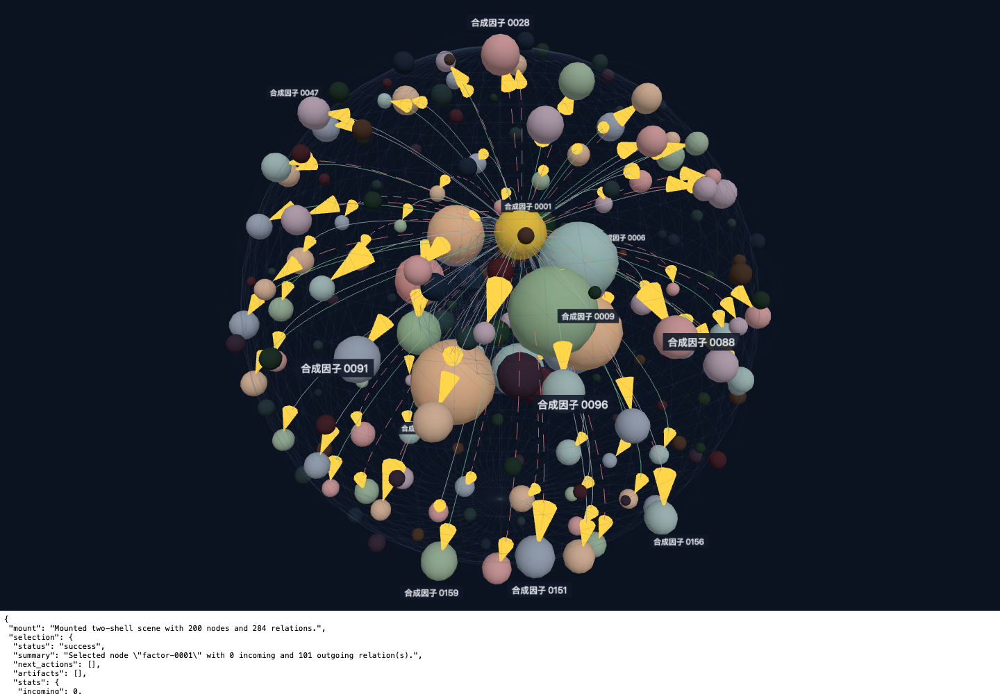
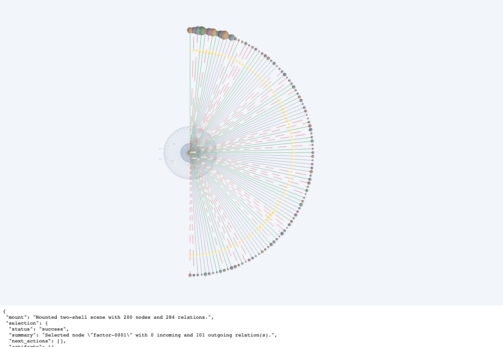
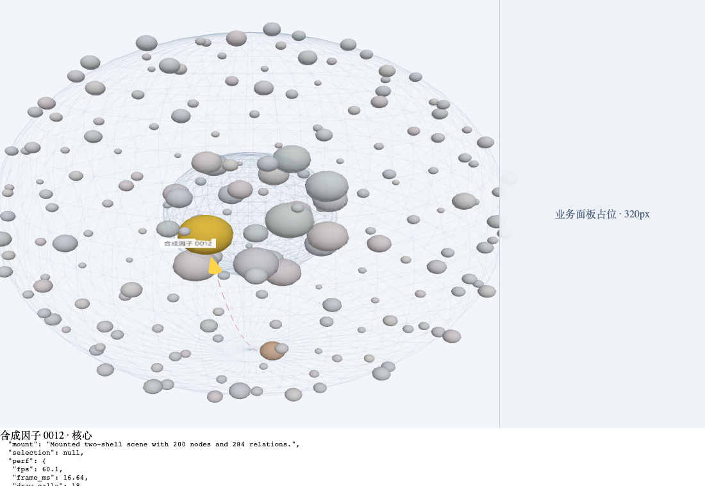
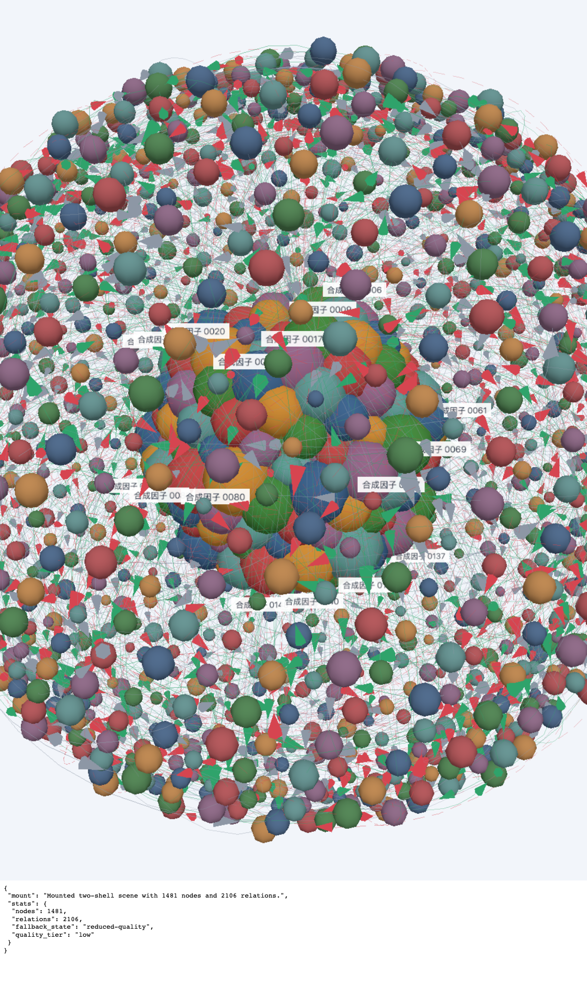
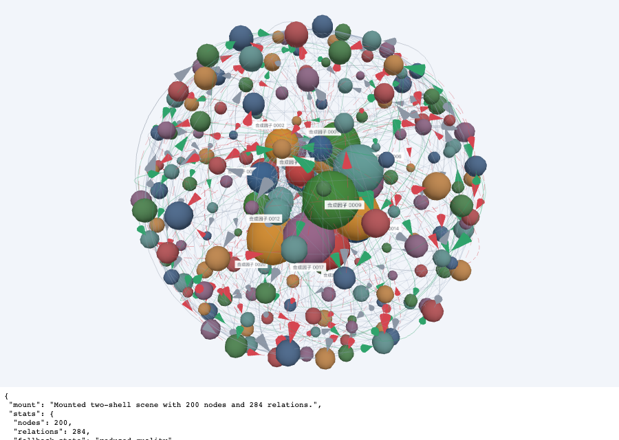
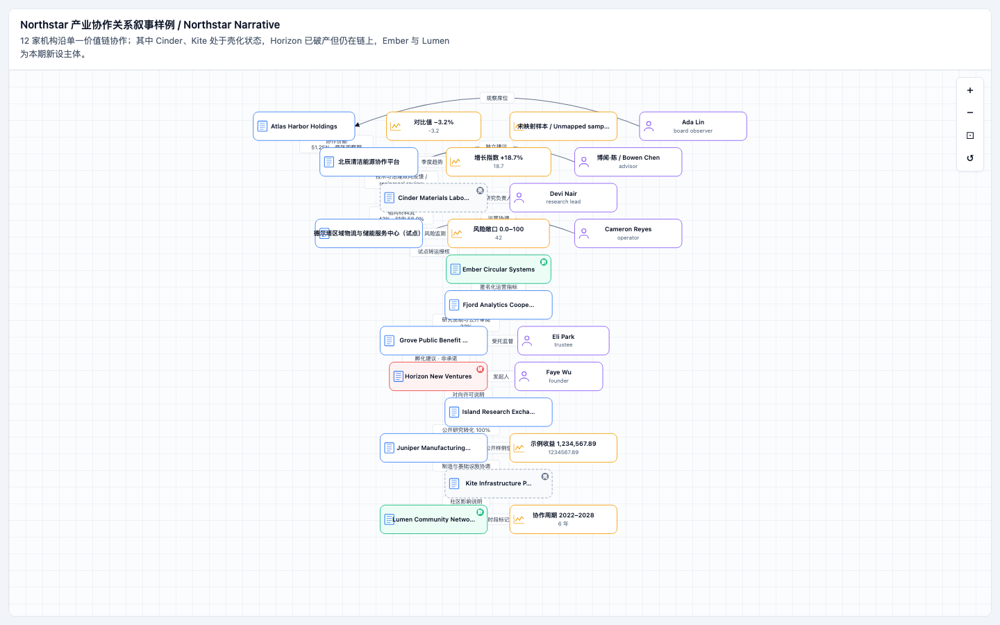
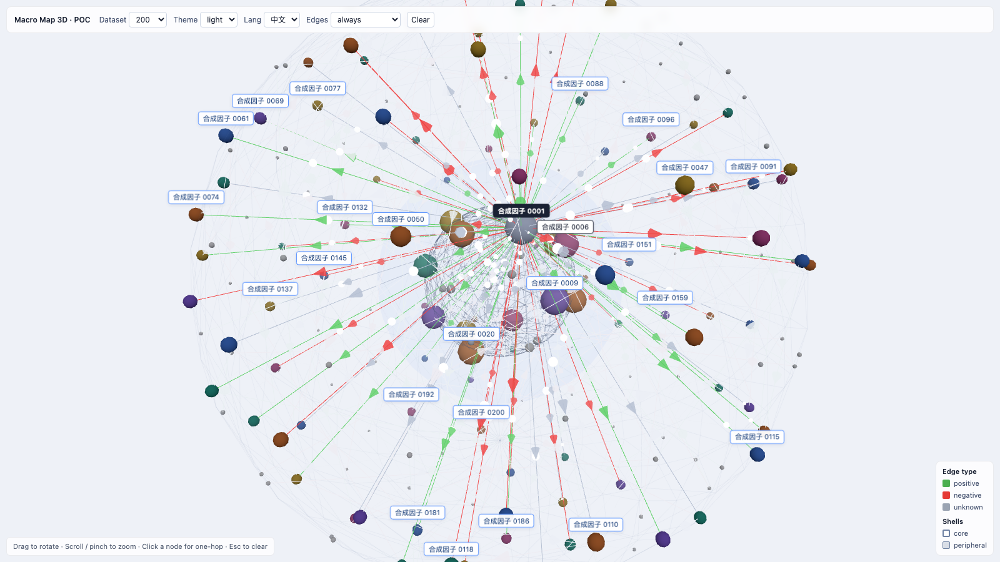

# VAB-T14 真实模型开发 Pilot

> 证据截点：2026-07-20 00:21:17 +08:00
>
> 状态：`ready_for_acceptance`
>
> 结论级别：development pilot；`human_review_pending`；`leaderboard_eligible=false`

## 给管理者的直接结论

Kimi K3 已独立完成复杂 3D 可视化 POC 的 S0–S4 CLI/checkpoint 阶段，每阶段 1 次，S4 的 build、typecheck、test 门禁通过，CLI 结果为 `success`。这证明它能够从需求理解推进到可运行候选产物，不只是生成一个静态 Demo。

但这次不能判定“业务已经接受”，也不能判定“Kimi 胜出”或已经产生确定的人效提升：

- 总墙钟时间为 9,888,981 ms，约 **164.8 分钟**；Kimi Code 0.27.0 未提供 Token 和费用数据。
- 正式人工视觉验收仍为 `human_review_pending`。
- Operator preview 发现：200 节点选中态箭头过大且拥挤；S3 ego 视图高度 hairball；3D 面板版可运行，但视觉层级和审美仍需人工微调。
- 最新 integration Harness 对该 run 执行确定性 evaluator 时，立即因 run 根目录缺少 `observation-attestation.json` 停止。已有 checkpoint 和模型自产 browser-checks，但它们不是 Harness attestation；本报告没有伪造 attestation。
- 上述 evaluator 结果是**证据链缺口，不是模型质量失败**。在缺口补齐前，该 run 不具备 conclusion/leaderboard 资格。

因此本轮最准确的管理判断是：**Kimi 已证明能独立完成复杂 POC 的 S0–S4 CLI/checkpoint 阶段并通过 S4 build/typecheck/test，但尚未完成 Harness-attested deterministic evaluator，也尚未证明能免人工完成产品级视觉交付。**

## 运行结果总览

| 模型 / 工具 | 案例 | CLI 结果 | 时间 | Token / 费用 | 可采信结论 |
|---|---|---|---:|---|---|
| Kimi K3 / Kimi Code 0.27.0 | 3D 宏观地图 | S0–S4 全成功，各 1 次 | 164.8 分钟 | 不可用 | 可独立完成复杂 POC 与工程阶段；人工视觉验收及 Harness attestation 未完成 |
| GPT-5.6 / Codex | 3D 宏观地图 | S0 失败 | 1.9 分钟 | 不可用 | 模型 metadata 缺失并反复超时，是路由/传输失败样本 |
| GPT-5.6-sol / Codex | 3D 宏观地图 | S0 成功；S1 两次后门禁失败 | 末次 6.1 分钟 | 1,490,313 in / 26,261 out；费用不可用 | 产出代码，但受旧 Harness resume 权限和 checkpoint 协议缺陷影响，不能用于模型归因 |
| DeepSeek V4 / Claude Code | 开发流程 smoke | S0–S2 成功 | 3.7 分钟 | 30,615 in / 11,687 out / $0.576699 | 只证明基础调用链可跑 |
| GLM-5.2 / Claude Code | 股权关系 | 续跑后 S0–S3 成功；S4 被 429 中断 | 末次续跑 31.8 分钟 | 总量不完整；S3/S4 新增报告 $13.302153 | 有部分可运行视觉产物，未完成、未人工验收 |
| GLM-5.2 / Claude Code | 3D 宏观地图 | 续跑后 S0–S3 成功；S4 被 429 中断 | 末次续跑 31.4 分钟 | 1,467,735 in / 182,486 out / 26,554,240 cached / $25.177945 | 有部分可运行视觉产物，未完成、未人工验收 |
| GPT-5.6-sol / Codex | 股权关系旧 smoke | S0–S5 进程退出成功 | 5.5 分钟 | 3,237,934 in / 43,167 out / CLI 报告 $0 | 旧 symbolic-checkpoint 评测器不可判定交付；$0 不视为真实账单 |
| DeepSeek default / Claude Code | 误触发 smoke | S0 前置失败，HTTP 400 模型不存在 | 1.7 秒 | 不计 Token / 费用 | 暴露运行前未校验模型配置的缺口，不是模型能力测试 |
| GPT-5.6-sol / Codex，最终加固 smoke | dev-workflow-smoke | S0–S2 全成功 | 9.0 分钟 | 545,598 in / 12,056 out / 453,632 cached；费用不可用 | 证明最终加固控制链可运行，不代表复杂可视化交付 |

最终 Codex smoke 运行于 Harness `68514fd`，后续观测与续跑修复已推进到本次收口时 integration HEAD `5774013`。run 自身不会追溯继承后续修复，因此报告同时保留两个版本点。

## Kimi 视觉证据与 Operator preview

以下图片是从 run 产物中精选复制的证据快照。它们用于定位人工复核点，不构成正式验收结论。

### S2：200 节点选中态

Operator preview：选中态能工作，但箭头尺寸偏大、局部连线和节点过于拥挤。

### S3：ego 视图

Operator preview：高度 hairball，关系可追踪性与阅读路径不足，不应直接视为业务可用。

### S3：3D 面板版

Operator preview：功能可运行，但主次层级、标签密度和整体审美仍需要人工微调。

### S4：移动端与上下文恢复

这些截图证明候选交付覆盖了移动端质量档位和上下文恢复场景；它们仍需正式人工复核交互连续性、可读性和产品细节。

### GLM 部分产物对照

GLM 在两个复杂案例中产出了可观察的中间视觉结果；后续续跑已完成 S3，但都在 S4 再次触达 5 小时额度上限，仍不能与已完成的 Kimi run 做同口径质量排名。这里的时长是末次续跑调用，旧 Harness 会覆盖总墙钟时间；股权关系任务也因部分 attempt 未上报 usage 而不能给出完整总量。

## Kimi 证据链状态

Kimi run 已冻结以下机器证据的 SHA-256：

- `result.json`
- `run-state.json`
- `checkpoints/S2.json`、`S3.json`、`S4.json`
- S2、S3、S4 的模型自产 `browser-checks.json`
- `artifacts/workspace.diff`
- 7 张精选截图

完整路径与 digest 见 `runs/pilots/2026-07-19/manifest.json`。

需要区分三层状态：

1. **CLI / checkpoint：已完成。** S0–S4 均成功，每阶段 1 次。
2. **Harness-attested deterministic evaluator：未完成。** 最新 evaluator 因缺少 run 根目录 `observation-attestation.json` 立即停止。
3. **正式人工视觉验收：pending。** Operator preview 只是缺陷预览，不是 accept/reject 签署。

不得把第一层成功直接升级成第三层业务接受，也不得把第二层证据缺口写成模型质量失败。

## Harness 与隔离边界

### Harness 版本不一致

T14 受控复杂 pilot 的 Harness commit 只能根据启动时分支重建为 `65e2b5a`，run 内没有加密绑定该 commit。它早于后续 checkpoint identity、Codex resume 写权限、Kimi 状态解析、不可变 package gate 和 observation attestation 等加固。

integration 历史复杂 run 使用旧 real-model smoke 流程，精确 commit 未落盘，而且 symbolic checkpoint 规则会把逻辑交付物名称当作字面文件路径。这类 evaluator 失败不能归因为模型功能失败。

最终 Codex smoke 证明 `68514fd` 版本的三阶段控制链能够跑通；收口时后续修复到 `5774013`。这是一项基础设施证据，不是复杂案例模型质量证据。

### Soft isolation 不是严格无污染隔离

所有 run 均为 `file-isolated-development`，使用独立 workspace，但继承 host authentication。该模式可以降低误读答案代码的概率，却不能证明 Agent 无法读取 workspace 外的 host 文件。

因此本批次统一保持：

- `leaderboard_eligible=false`
- `human_review_pending`
- 不声称模型胜出
- 不声称业务接受
- 不声称已测得真实提效

## 本轮暴露的工程与管理问题

1. 复杂 POC 可以自动完成，但耗时并不短。Kimi 单次约 164.8 分钟，且 Token/费用不可观测。
2. “生成并运行”与“产品级可用”之间的主要差距仍是视觉层级、密度、交互细节和反复微调。
3. 模型自产 browser-checks 不能替代 Harness 独立 attestation；证据链必须在运行时完整生成。
4. 运行前需要校验“工具—provider—模型代码”的可用映射。误触发 DeepSeek default smoke 在请求发出后才收到 400，应改为 preflight fail-fast。
5. GLM 两个复杂任务续跑后均推进到 S4，但再次触达 5 小时额度上限；其中一次总 usage 仍不完整，说明并行评测还受账户配额、遥测完整性和费用约束。
6. 不同 Harness 版本、不同 checkpoint 协议、不同费用口径不能直接横向排名。

## 下一步验收条件

要从“Pilot 证据”升级到“领导可用的提效结论”，至少需要：

1. 在最新版 Harness 下重新生成真实 `observation-attestation.json`，不得人工补造。
2. 由人按固定视口、固定数据量和固定状态完成视觉/交互验收，记录缺陷、修改轮次和人工触达时间。
3. 在相同案例上建立人工基线，分别记录需求澄清、编码、测试、微调和返工人时。
4. 对候选模型使用同一 Harness commit、同一预算、同一隔离级别复跑。
5. 若要发布排行榜，升级为容器或专用用户隔离。

在这些条件满足前，本报告只支持“复杂 POC 可自动完成”的结论，不支持业务接受、模型胜负或确定的人效比结论。
